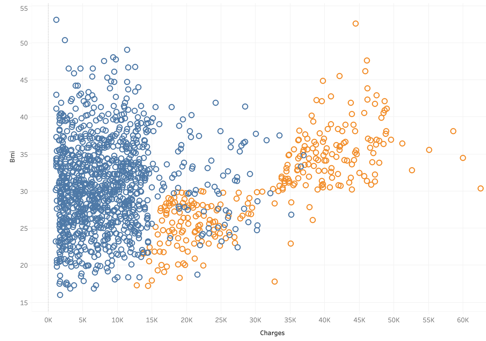

# Medical Insurance Cost Predictor

## Overview

This project predicts medical insurance costs using machine learning models trained on demographic and health-related features such as age, BMI, number of children, smoking status, sex, and region.

The project  includes a Streamlit web interface, making it easier to showcase the model, test different patient profiles, view estimated yearly insurance charges, and compare model performance.

## Features

- Predict medical insurance charges from user input
- Interactive Streamlit UI with sidebar controls
- Supports inputs for age, sex, BMI, children, smoker status, and region
- Displays estimated yearly insurance cost
- Shows dataset average, median charge, MAE, and R-squared score
- Includes visual analysis charts for insurance charges
- Displays model comparison results
- Provides dataset preview inside the app

## Streamlit UI

The Streamlit app provides a clean interface for demonstrating the insurance cost predictor.

Users can adjust the following inputs:

- Age
- Sex
- BMI
- Number of children
- Smoking status
- Region
- Prediction model

The app instantly displays the predicted insurance cost and related model metrics.

## Data Visualization (Tableau)

To better understand the dataset before model building, I performed exploratory data analysis using Tableau.

### 1. BMI vs Insurance Charges

#### BMI vs Charges



- This scatter plot shows the relationship between BMI and insurance charges.
- A slight positive trend can be observed — higher BMI often leads to higher costs.
- Data points are colored based on smoking status to highlight impact differences.

---

### 2. Smoker vs Insurance Charges

#### Smoker vs Charges


- This bar chart compares average insurance charges between smokers and non-smokers.
- Smokers have significantly higher charges compared to non-smokers.
- This indicates smoking is one of the strongest factors affecting insurance cost.

---

### Key Insights

- Smoking status has the highest impact on insurance pricing.
- BMI and age also show a positive correlation with charges.
- Visualization helped in understanding feature importance before training the model.


## Dataset

The dataset used in this project contains individual insurance records and medical insurance charges.

Dataset columns:

- `age`: Age of the individual
- `sex`: Gender of the individual
- `bmi`: Body Mass Index
- `children`: Number of children covered by insurance
- `smoker`: Smoking status
- `region`: Residential region
- `charges`: Medical insurance cost, used as the target variable

The `insurance.csv` file should be placed in the same folder as `app.py`.

## Models Used

The notebook explores multiple machine learning models, including:

- Linear Regression
- Logistic Regression
- K-Nearest Neighbors
- Decision Tree
- Naive Bayes
- Random Forest

The Streamlit app focuses on regression-based prediction and includes:

- Random Forest Regressor
- Linear Regression

## Evaluation Metrics

The models are evaluated using common regression metrics:

- Mean Absolute Error (MAE)
- Root Mean Squared Error (RMSE)
- R-squared Score

These metrics help measure how close the predicted insurance charges are to the actual charges.

## Project Structure

```text
medical_insurance/
├── app.py
├── insurance.csv
├── Medical_Insurance.ipynb
├── requirements.txt
└── README.md
```

## Installation

Install the required dependencies:

```bash
pip install -r requirements.txt
```

## Run the Streamlit App

Start the app with:

```bash
streamlit run app.py
```

Then open the local URL shown in the terminal, usually:

```text
http://localhost:8501
```

## Requirements

Main libraries used:

- Streamlit
- Pandas
- NumPy
- Scikit-learn
- Altair

## Future Improvements

- Save the best trained model as a `.pkl` file
- Add more advanced regression models
- Add feature importance visualization
- Improve model accuracy with hyperparameter tuning
- Deploy the Streamlit app online

## Conclusion

This project demonstrates how machine learning can be used to estimate medical insurance costs and how Streamlit can turn a notebook-based model into an interactive web application for easier presentation and testing.


